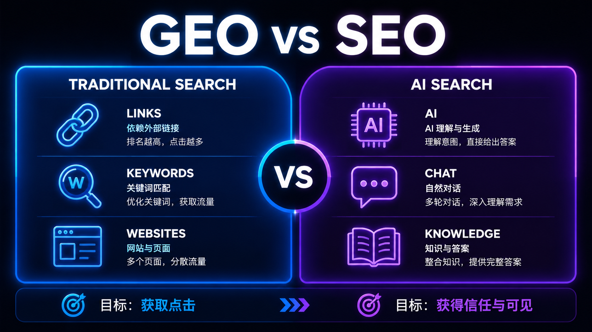
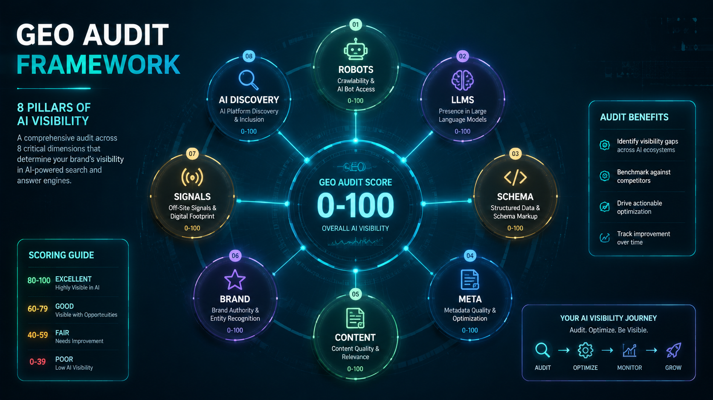
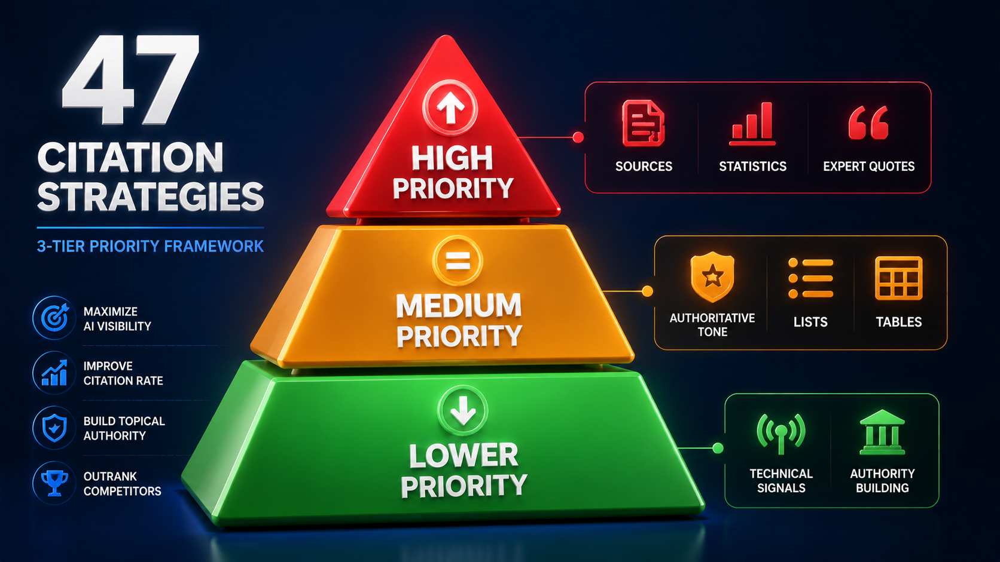

# GEO Optimization Handbook

> A comprehensive guide to **Generative Engine Optimization (GEO)** — optimizing content for AI search engines like ChatGPT Search, Perplexity, Google AI Overviews, Gemini, Claude, and more.

[](LICENSE)
[](CONTRIBUTING.md)
[](https://github.com/qq136692547-cmyk/geo-optimization-handbook)
[](https://github.com/qq136692547-cmyk/geo-optimization-handbook/commits/main)
[](https://github.com/amplifying-ai/awesome-generative-engine-optimization)

---

## 📖 What is GEO?

**Generative Engine Optimization (GEO)** is the practice of optimizing content so AI-powered search engines cite, summarize, or recommend your content in their responses.

Coined in the paper [*GEO: Generative Engine Optimization*](https://arxiv.org/abs/2311.09735) (KDD 2024), GEO addresses a fundamental shift: users increasingly get answers from AI-generated responses rather than blue links. Traditional SEO targets ranking in link lists; GEO targets **being cited as a source** in AI-generated answers.

---

## 🖼️ At a Glance

| GEO vs SEO | GEO Audit Framework | 47 Citation Strategies |
|:---:|:---:|:---:|
|  |  |  |

## 🎯 Why GEO Matters in 2026

| Stat | Source |
|------|--------|
| ChatGPT has **400M+ weekly active users** with AI search built-in | OpenAI (2026) |
| Google AI Overviews now covers **1B+ queries/month** | Google |
| **40%+ visibility improvement** possible with GEO strategies | KDD 2024 / ICLR 2026 |
| **28.3%** of ChatGPT's most-cited pages have **zero Google organic visibility** | Ahrefs |
| Correct JSON-LD schema boosts LLM extraction from **16% to 54%** | Semrush |
| AI search queries average **23 words** (vs 4 for traditional search) | Multiple studies |
| **Growing share of searches never reach blue links** in 2026 | SMDigital Partners |
| GEO can **rank your content in ChatGPT in 14 days** | OtterlyAI experiment |

## 📚 Contents

### Methodology

| # | Topic | Description |
|---|-------|-------------|
| 1 | [Core Concepts](./methodology/01-core-concepts.md) | What GEO is, how it differs from SEO, why it matters |
| 2 | [AI Search Platforms](./methodology/02-ai-search-platforms.md) | How ChatGPT, Perplexity, Google AIO, Gemini, Claude, and Chinese platforms work |
| 3 | [47 Citation Strategies](./methodology/03-citation-strategies.md) | Proven methods ranked by impact (from KDD 2024 + ICLR 2026 research) |
| 4 | [Structured Data](./methodology/04-structured-data.md) | FAQPage, HowTo, Article, Organization schemas for AI extraction |
| 5 | [Trust Stack](./methodology/05-trust-stack.md) | 5-layer trust scoring system for AI engine credibility |
| 6 | [Negative Signals](./methodology/06-negative-signals.md) | 8 signals that cause AI engines to deprioritize your content |
| 7 | [Academic Research](./methodology/07-academic-research.md) | Key papers: KDD 2024, ICLR 2026, NeurIPS 2025, EMNLP 2024 |

### Practical Guides

| # | Guide | Applies To |
|---|-------|------------|
| 1 | [Static Site GEO](./practical-guides/01-static-site-geo.md) | GitHub Pages, any static HTML site |
| 2 | [FAQPage & HowTo Schema](./practical-guides/02-faqpage-howto-schema.md) | Any content site, documentation |
| 3 | [Blogger GEO Implementation](./practical-guides/03-blogger-geo.md) | Blogger / Blogspot blogs |
| 4 | **[GEO for Small Businesses](./practical-guides/04-small-business-geo.md) 🆕** | Small business websites, local SEO + GEO |

### Checklists & Tools

| Resource | What It Does |
|----------|-------------|
| [Pre-Publish Checklist](./checklists/pre-publish-checklist.md) | 8-item self-check before publishing any content |
| [Audit Scoring](./checklists/audit-scoring.md) | 8-dimension scoring system (0-100) |
| [Robots.txt Template](./templates/robots-template.md) | Allow AI citation, block AI training |

## 🚀 Quick Start

### For Content Creators

```bash
# 1. Read the core concepts
cat methodology/01-core-concepts.md

# 2. Apply the top-5 citation strategies
cat methodology/03-citation-strategies.md

# 3. Add FAQPage schema to your content
cat practical-guides/02-faqpage-howto-schema.md

# 4. Run the pre-publish checklist
cat checklists/pre-publish-checklist.md
```

### For Site Owners

```bash
# 1. Deploy robots.txt that allows AI citation bots
cat templates/robots-template.md

# 2. Add structured data to key pages
cat practical-guides/02-faqpage-howto-schema.md

# 3. Apply static site GEO optimizations
cat practical-guides/01-static-site-geo.md
```

## 🏗️ Project Structure

```
geo-optimization-handbook/
├── README.md
├── LICENSE
├── CONTRIBUTING.md
├── methodology/
│   ├── 01-core-concepts.md
│   ├── 02-ai-search-platforms.md
│   ├── 03-citation-strategies.md
│   ├── 04-structured-data.md
│   ├── 05-trust-stack.md
│   ├── 06-negative-signals.md
│   └── 07-academic-research.md
├── practical-guides/
│   ├── 01-static-site-geo.md
│   ├── 02-faqpage-howto-schema.md
│   ├── 03-blogger-geo.md
│   └── 04-small-business-geo.md 🆕
├── assets/
│   └── images/
│       ├── geo-vs-seo.png
│       ├── geo-audit-framework.png
│       └── 47-citation-strategies.png
├── checklists/
│   ├── pre-publish-checklist.md
│   └── audit-scoring.md
└── templates/
    └── robots-template.md
```

## 📖 How to Use This Handbook

- **New to GEO?** Start with [Core Concepts](./methodology/01-core-concepts.md), then apply the [Pre-Publish Checklist](./checklists/pre-publish-checklist.md) to your existing content.
- **Already doing SEO?** Read [Citation Strategies](./methodology/03-citation-strategies.md) and [Structured Data](./methodology/04-structured-data.md) — these complement your existing SEO work.
- **Running static sites?** The [Static Site Guide](./practical-guides/01-static-site-geo.md) and [Blogger Guide](./practical-guides/03-blogger-geo.md) are for you.
- **Small business owner?** Start with the [Small Business GEO Guide](./practical-guides/04-small-business-geo.md) — no technical expertise required.

## What's New (July 2026)

- 🆕 **New guide**: [GEO for Small Businesses](./practical-guides/04-small-business-geo.md) — zero-click search survival guide for 2026
- 📊 Updated statistics with latest 2026 data across all chapters
- 🔬 Added recent research: C-SEO Bench (NeurIPS 2025), IF-GEO, Multimodal GEO papers

## 🛠️ Built with This Handbook

| Project | Description |
|---------|-------------|
| [GeoScore](https://geoscore.help/) | Free GEO audit tool — scores your site 0–100 across 12 dimensions, generates llms.txt, robots.txt, and JSON-LD fixes. Built from this handbook's methodology. |

## 🤝 Contributing

GEO is a rapidly evolving field. This handbook aims to stay current with the latest research and platform changes. Contributions welcome!

See [CONTRIBUTING.md](CONTRIBUTING.md) for guidelines.

## 📚 References

| Source | Type | Topic |
|--------|------|-------|
| [arXiv:2311.09735](https://arxiv.org/abs/2311.09735) | Academic Paper | GEO: Generative Engine Optimization (KDD 2024) |
| [arXiv:2510.11438](https://arxiv.org/abs/2510.11438) | Academic Paper | AutoGEO: Automatic GEO (ICLR 2026) |
| [arXiv:2601.13938](https://arxiv.org/abs/2601.13938) | Academic Paper | IF-GEO: Conflict-Aware Instruction Fusion (2026) |
| [C-SEO Bench (NeurIPS 2025)](https://arxiv.org/abs/2506.11097) | Academic Paper | Conversational SEO Benchmark |
| [Auriti-Labs GEO Optimizer](https://github.com/Auriti-Labs/geo-optimizer-skill) | Open Source | GEO audit framework (MIT) |
| [llmstxt.org](https://llmstxt.org) | Specification | llms.txt standard for AI crawlers |
| [Google Search Central](https://developers.google.com/search/docs/fundamentals/ai-content) | Documentation | AI content and search |
| [SEMrush GEO Guide](https://www.semrush.com/blog/generative-engine-optimization/) | Industry Guide | Practical GEO strategies |
| [OtterlyAI GEO Experiment](https://otterly.ai/blog/from-zero-to-rank7-ai-search-in-14days/) | Case Study | #7 in ChatGPT in 14 days |

## 📄 License

MIT License — see [LICENSE](LICENSE) for details.

---

*Maintained by [L.D. Studio](https://github.com/qq136692547-cmyk) — helping content creators thrive in the AI search era.*